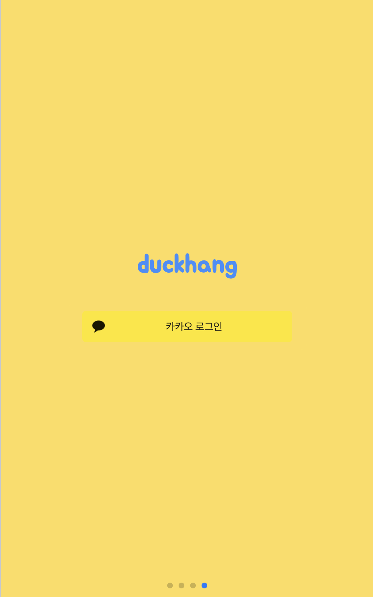
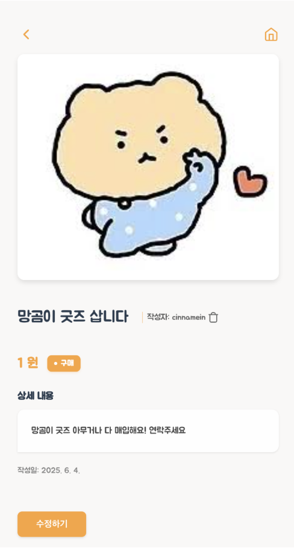
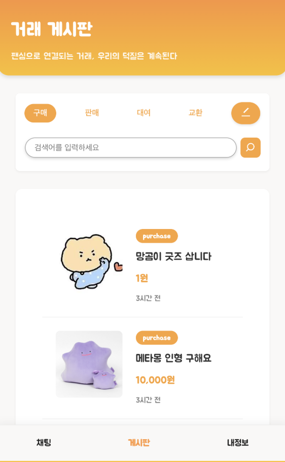
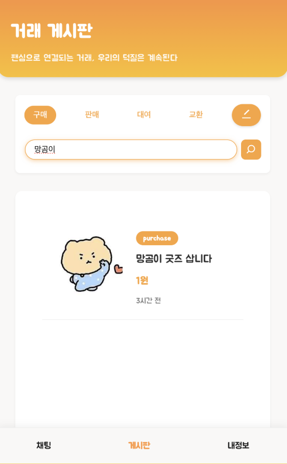
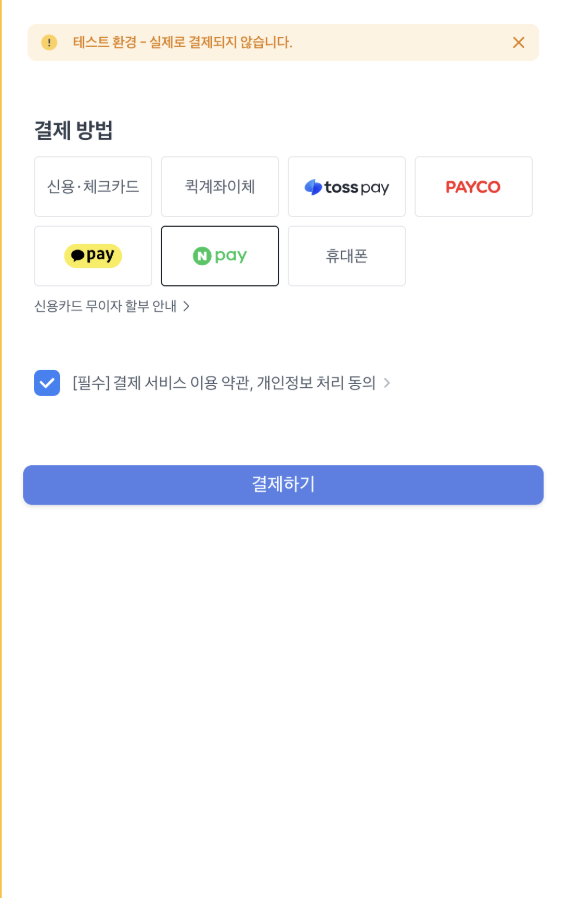
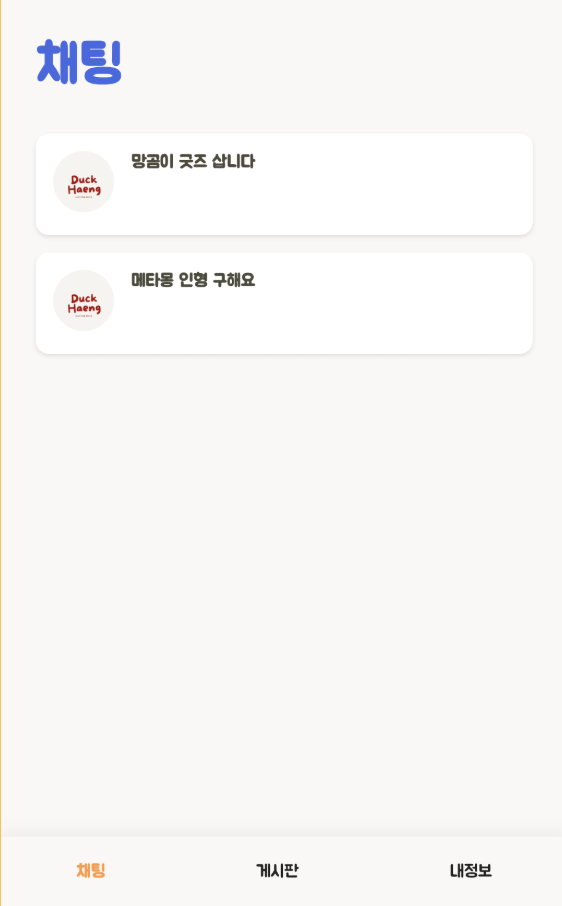
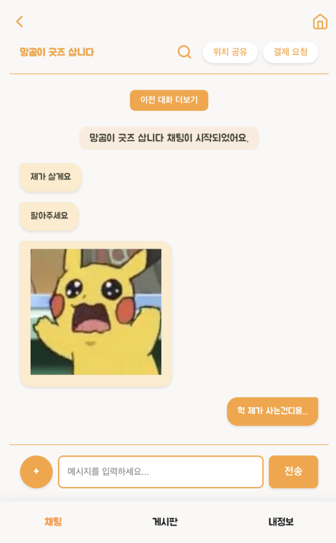
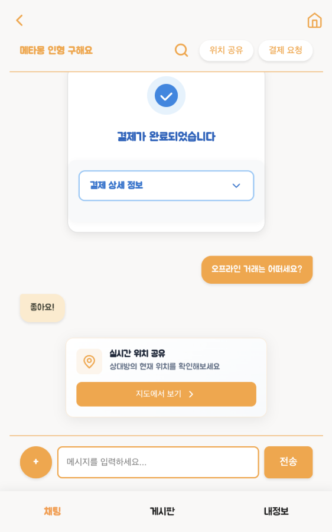
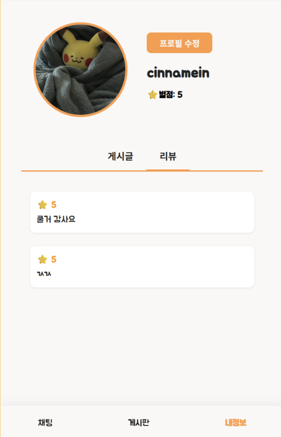

# 🐥 덕행
> 굿즈 관리부터 커뮤니티까지 덕질은 **덕행** 하나로.

---

## 📣 프로젝트 소개

**덕행(Dukhaeng)** 은 팬 활동에 필요한 모든 기능을 하나의 서비스로 통합한 올인원 플랫폼입니다.
굿즈 거래, 커뮤니티 등 팬덤 문화 속 다양한 니즈를 충족하여 팬 문화의 활성화를 목표로 합니다.

**📍 프론트 코드는 [여기](https://github.com/oridungjeol/duckhang-front)서 확인하실 수 있습니다.**

---

## 👩‍💻 팀원 소개

| 이름 | GitHub |
| - | - |
| 🐱 박상연 | [박상연의 GitHub](https://github.com/ysang989) |
| 🐶 박유민 | [박유민의 GitHub](https://github.com/yumin1209) |
| 🐹 윤채민 | [윤채민의 GitHub](https://github.com/cinnamein) |
| 🐨 전유영 | [전유영의 GitHub](https://github.com/Azamman327) |

---

## 🌟 서비스 기능

| 기능 | 설명 | 담당자 |
| - | - | - |
| 🔐 **로그인 / 회원가입** | 카카오 등 소셜 계정을 통한 간편한 회원 시스템 | 윤채민 |
| 📝 **게시글 관리** | 사진과 함께 물품 정보를 업로드하여 거래 게시글 등록 | 박상연 |
| 🔍 **물품 검색** | 게시글 제목을 기반으로 빠른 물품 검색 가능 | 박유민 |
| 💳 **TOSS 결제 연동** | 마음에 드는 굿즈를 안전하게 결제 | 박유민 |
| 💬 **실시간 채팅** | 판매자와 1:1 채팅으로 실시간 소통 | 전유영 |
| ⚠️ **사기 메시지 탐지** | 채팅 내용을 자동 분석하여 의심 메시지 경고 | 전유영 |
| 👤 **프로필 관리** | 사용자 정보, 거래글, 리뷰를 확인할 수 있는 페이지 | 윤채민 |
| 🗺️ **위치 공유** | 직거래를 위한 위치 정보 지도 공유 기능 제공 | 전유영 |

---

## 🎥 미리보기 (스크린샷 or GIF)

### 🔐 로그인, 회원가입

 
소셜 로그인 기능

### 📝 게시글 업로드

 
게시글 등록 및 상세 조회 기능

### 🔍 물품 검색

 
게시글 제목 기반 검색 기능

### 💳 TOSS 결제 연동

 
채팅방 내 실시간 TOSS 결제 기능

### 💬 실시간 채팅

 
1:1 실시간 채팅 기능 (WebSocket 기반)

### 🗺️ 위치 공유

 
실시간 위치 공유 기능 (Kakao 지도 API)

### 🌟 리뷰 작성

 
거래 완료 후 리뷰 작성 기능

### 👤 프로필 관리

 
사용자 프로필, 게시글 및 리뷰 관리 기능

---

## 🛠 기술 스택

| 구분 | 사용 기술 |
| - | - |
| **Backend** | Spring Boot, Java, Spring Security, WebSocket, Firebase |
| **Frontend** | React, JavaScript |
| **Database** | MySQL, Redis |
| **Search & Logging** | Elasticsearch, Kibana |
| **Infra / DevOps** | Docker, Nginx |
| **API 연동** | TOSS 결제 API, Kakao 소셜 로그인, Kakao Maps API |

---

## 시스템 아키텍처

---
